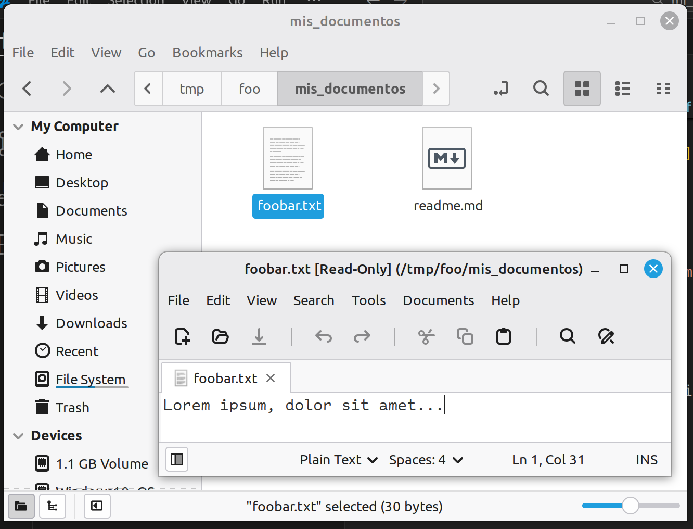

# pyjsonfs
Código simple que implementa un pequeño sistema de archivos en Python con FUSE y que usa JSON para definir su estructura. 

# Instalación
A continuacion las instrucciones para Debian 13. Instale los paquetes de acuerdo a su distribución.
```bash
$ sudo apt update
$ sudo apt install fuse3
```

Clone el repositorio:
```bash
$ git clone https://github.com/andlin151/pyjsonfs.git
$ cd pyjsonfs
```

Opcional: Usar Virtualenv para instalar FUSEPy
```bash
$ virtualenv ./venv
$ source ./venv/bin/activate
```

Luego instale FUSEPy con pip:
```bash
$ pip install fusepy
```

Cree algún directorio que sirva de punto de montaje:
```bash
$ mkdir /tmp/foo
```

Finalmente ejecútelo de esta forma:

```bash
$ ./pyjsonfs.py archivo.json /tmp/foo
```
# Fotocapturas



